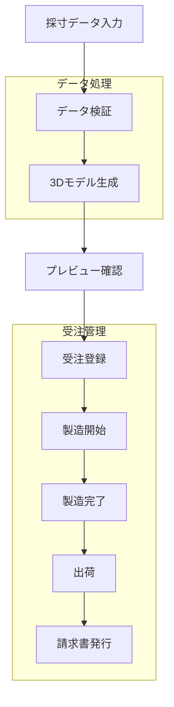
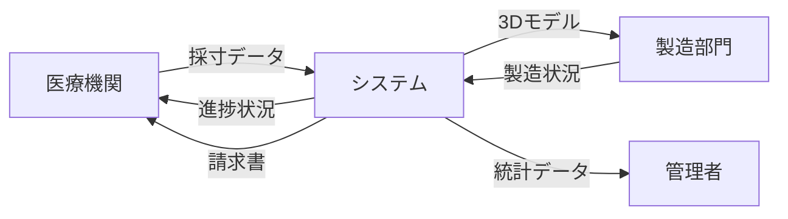
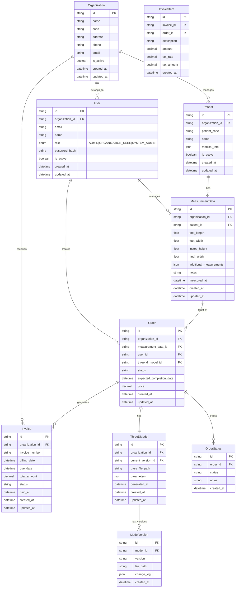

# データモデル設計書

## 1. システム処理フロー

## 2. データフロー

## 3. ERD

## 4. 主要エンティティの説明

### Organization（医療機関）
- 医療機関の基本情報を管理
- マルチテナント対応の基準となるエンティティ
- 各医療機関のデータを論理的に分離
- 独自の患者コード体系を採用可能

### Patient（患者）
- 医療機関ごとの患者情報を管理
- 医療機関独自の患者コード体系に対応
- 医療情報はJSON形式で柔軟に保存（必須項目は今後定義）
- 組織ごとに独立した患者管理が可能

### User（ユーザー）
- システムを利用するユーザーの情報を管理
- 組織に所属し、以下の役割を持つ：
  - SYSTEM_ADMIN: システム全体の管理者
  - ADMIN: 医療機関の管理者
  - ORGANIZATION_USER: 医療機関の一般ユーザー
- 医療機関内では同一の権限を持ち、他組織のデータにはアクセス不可

### MeasurementData（採寸データ）
- 患者の足の採寸データを管理
- 組織ごとにデータを分離
- 基本的な測定値に加え、追加の測定値をJSON形式で保存可能

### Order（受注）
- 医療用シューズの受注情報を管理
- 組織、採寸データ、3Dモデル、担当者との関連を保持
- 価格情報を含む

### ThreeDModel（3Dモデル）
- 生成された3Dモデルの基本情報を管理
- 現在のバージョンへの参照を保持
- 組織ごとにモデルを管理

### ModelVersion（モデルバージョン）
- 3Dモデルの各バージョンを管理
- 変更履歴をJSON形式で保存
- ファイルパスで実体を参照

### OrderStatus（受注状況）
- 受注の状態変更履歴を管理
- 各状態変更時のメモを記録
- 時系列での進捗追跡が可能

### Invoice（請求書）
- 医療機関への請求書情報を管理
- 製品出荷時に自動発行
- 請求日、支払期限、支払状況を追跡
- 後払い方式に対応
- 承認フロー機能は将来的な拡張として考慮

### InvoiceItem（請求書明細）
- 請求書の明細項目を管理
- 受注との紐付けを保持
- 税率、税額の計算に対応

## 5. 注意事項

1. セキュリティ考慮事項
   - 個人情報（患者データ）は暗号化して保存
   - アクセスログは別テーブルで管理（設計省略）
   - 組織間のデータアクセスを厳密に制御
   - ユーザーは所属組織のデータのみアクセス可能

2. パフォーマンス考慮事項
   - 3Dモデルデータは外部ストレージに保存
   - 頻繁なステータス更新に対応した設計
   - 組織ごとのデータ分離による効率的なクエリ

3. 拡張性考慮事項
   - 追加の測定項目に対応できるJSON形式の採用
   - バージョン管理可能な3Dモデル設計
   - 将来的な課金体系の変更に対応可能な設計

## 6. 運用方針

1. データ保持ポリシー
   - 基本データ：無期限保持
   - 3Dモデル：バージョン管理により世代を保持
   - アーカイブ：具体的な期間は未定

2. 操作履歴
   - 具体的な記録対象操作：未定
   - 保持期間：未定
   - 実装方針：別テーブルでの管理を想定

3. バックアップ方針
   - データベース：日次増分、週次フル
   - 3Dモデルファイル：変更時にバージョン保持
   - 請求書データ：無期限保持

## 7. 未確定事項

以下の点については、要件の確認が必要です：

1. 請求書承認フローの要否
2. 患者の医療情報における必須項目の定義
3. ユーザー操作履歴の追跡
4. データアーカイブポリシー
5. 3Dモデルのバージョン管理詳細

## 8. アクセス制御ポリシー

1. 組織間データアクセス
   - ユーザーは自組織のデータのみアクセス可能
   - 他組織のデータは完全に分離

2. 組織内権限
   - 医療機関内のユーザーは同一の権限を持つ
   - データの作成・読取・更新・削除が可能

3. システム管理者権限
   - SYSTEM_ADMINは全組織のデータにアクセス可能
   - システム設定、マスターデータの管理が可能

4. 自動処理の権限
   - 請求書自動発行などのシステム処理は制限なく実行可能
   - 処理結果は関連する組織のみアクセス可能 